# Lược đồ cho báo cáo (bản đã sửa theo review)

Danh sách chức năng: xem `phan-tich-chuc-nang.md`. Ghi chú trong lược đồ viết bằng tiếng Anh.
Xem/xuất ảnh: dán từng khối mã vào https://mermaid.live (Actions → PNG/SVG).

- Chức năng 1–5: vẽ theo **code hiện tại**.
- Chức năng 6 (Shop) và trạng thái Shop của GameManager: vẽ theo `thiet-ke-shop.md` và `kich-ban-man-choi.md`, **chưa có code**, đánh dấu *(planned)*.
- Quy ước UML: transition không làm đổi trạng thái được ghi là **transition nội bộ** trong ô trạng thái, dạng `event [guard] / action`.

## Chưa vẽ vì code chưa làm

| Phần | Thuộc mốc | Tài liệu |
|---|---|---|
| Trạng thái `UsingSkill` của Player | 4 | `thiet-ke-nhan-vat.md` mục 6 |
| Trạng thái `Attack` của quái Ranged / Charger / Exploder | 6 | `thiet-ke-quai.md` mục 3.3, 5 |
| Thẻ lên cấp `SkillLevel` và `Evolution` | 4, 5 | `thiet-ke-vu-khi.md` mục 5 |
| Trạng thái `Paused`, `BossFight`, `Victory` của GameManager | 3, 6 | `kich-ban-man-choi.md` mục 4 |

## Sơ đồ tuần tự theo use case (13 sơ đồ)

Mỗi use case một sơ đồ tuần tự cho kịch bản chính. Bảng này cũng là danh sách để vẽ sơ đồ use case: actor `User` cho các UC người chơi thực hiện, actor `System` cho nhóm D (chạy tự động).

| Nhóm | Use case | Actor | Sơ đồ | Code |
|---|---|---|---|---|
| A. Bắt đầu ván | UC1. Chọn nhân vật và độ khó, vào ván | User | **7.1** | Có |
| B. Điều khiển nhân vật | UC2. Di chuyển và ngắm | User | **7.2** | Có |
| | UC3. Xem bảng chỉ số (giữ Tab) | User | **7.3** | Có |
| C. Chiến đấu | UC4a. Tấn công cận chiến | User | **2.2** | Có |
| | UC4b. Tấn công tầm xa | User | **7.4** | Planned |
| | UC5. Nhận sát thương | User | **1.2** | Có |
| D. Quái | UC6. Sinh quái và cập nhật | System | **3.2** | Có |
| | UC7. Quái chết và thu hồi | System | **7.5** | Có |
| E. Phát triển nhân vật | UC8. Nhặt XP và vàng | User | **4.2** | Có |
| | UC9. Lên cấp và chọn nâng cấp | User | **5.2** | Có |
| F. Shop | UC10. Mua đồ | User | **6.2** | Planned |
| | UC11. Làm mới hàng và bỏ đồ | User | **7.6** | Planned |
| G. Kết thúc ván | UC12. Thua, tính điểm, chơi lại hoặc về menu | User | **7.7** | Có |

---

## 1. Điều khiển nhân vật và sinh tồn

### 1.1. Sơ đồ trạng thái: Player

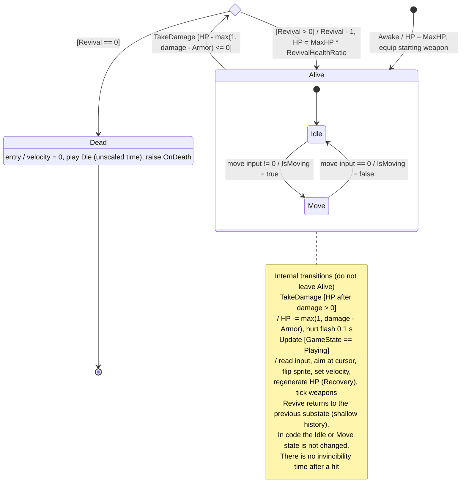
```mermaid
stateDiagram-v2
    state ReviveCheck <<choice>>
    state "Dead" as Dead

    [*] --> Alive : Awake / HP = MaxHP, equip starting weapon

    state Alive {
        [*] --> Idle
        Idle --> Move : move input != 0 / IsMoving = true
        Move --> Idle : move input == 0 / IsMoving = false
    }

    Alive --> ReviveCheck : TakeDamage [HP - max(1, damage - Armor) <= 0]
    ReviveCheck --> Alive : [Revival > 0] / Revival - 1, HP = MaxHP * RevivalHealthRatio
    ReviveCheck --> Dead : [Revival == 0]

    Dead : entry / velocity = 0, play Die (unscaled time), raise OnDeath
    Dead --> [*]

    note right of Alive
        Internal transitions (do not leave Alive)
        TakeDamage [HP after damage > 0]
            / HP -= max(1, damage - Armor), hurt flash 0.1 s
        Update [GameState == Playing]
            / read input, aim at cursor, flip sprite, set velocity,
              regenerate HP (Recovery), tick weapons
        Revive returns to the previous substate (shallow history).
        In code the Idle or Move state is not changed.
        There is no invincibility time after a hit
    end note
```

### 1.2. Sơ đồ tuần tự: Player nhận sát thương từ quái

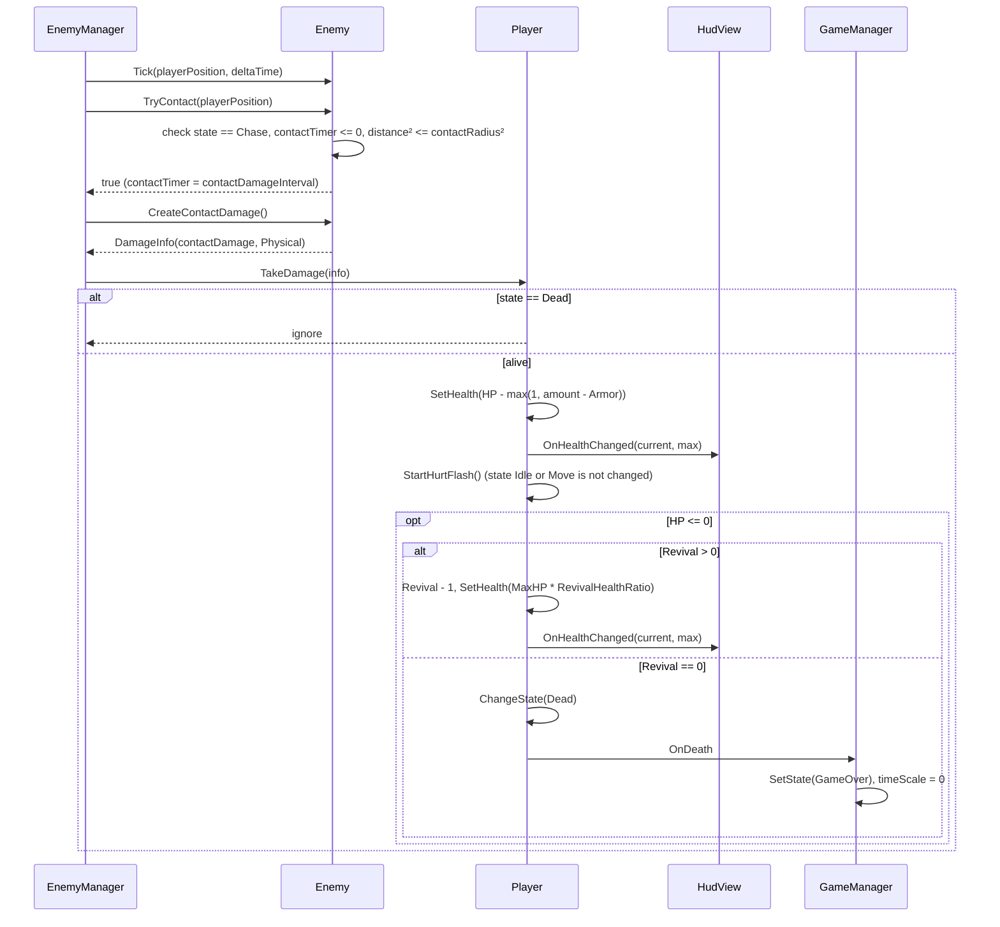
```mermaid
sequenceDiagram
    participant EM as EnemyManager
    participant E as Enemy
    participant P as Player
    participant HUD as HudView
    participant GM as GameManager

    EM->>E: Tick(playerPosition, deltaTime)
    EM->>E: TryContact(playerPosition)
    E->>E: check state == Chase, contactTimer <= 0, distance² <= contactRadius²
    E-->>EM: true (contactTimer = contactDamageInterval)
    EM->>E: CreateContactDamage()
    E-->>EM: DamageInfo(contactDamage, Physical)
    EM->>P: TakeDamage(info)

    alt state == Dead
        P-->>EM: ignore
    else alive
        P->>P: SetHealth(HP - max(1, amount - Armor))
        P->>HUD: OnHealthChanged(current, max)
        P->>P: StartHurtFlash() (state Idle or Move is not changed)
        opt HP <= 0
            alt Revival > 0
                P->>P: Revival - 1, SetHealth(MaxHP * RevivalHealthRatio)
                P->>HUD: OnHealthChanged(current, max)
            else Revival == 0
                P->>P: ChangeState(Dead)
                P->>GM: OnDeath
                GM->>GM: SetState(GameOver), timeScale = 0
            end
        end
    end
```

---

## 2. Tấn công tự động

### 2.1. Sơ đồ trạng thái: Weapon

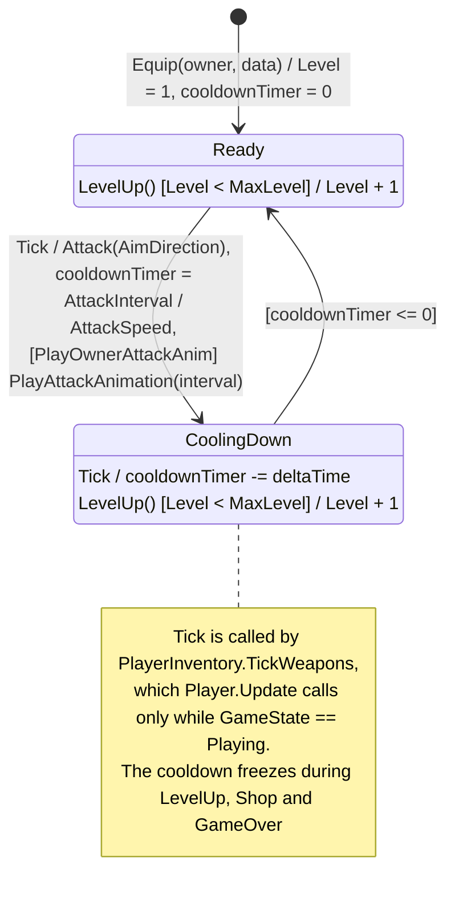
```mermaid
stateDiagram-v2
    state "Ready" as Ready
    state "CoolingDown" as CoolingDown

    [*] --> Ready : Equip(owner, data) / Level = 1, cooldownTimer = 0

    Ready --> CoolingDown : Tick / Attack(AimDirection), cooldownTimer = AttackInterval / AttackSpeed, [PlayOwnerAttackAnim] PlayAttackAnimation(interval)
    CoolingDown --> Ready : [cooldownTimer <= 0]

    Ready : LevelUp() [Level < MaxLevel] / Level + 1
    CoolingDown : Tick / cooldownTimer -= deltaTime
    CoolingDown : LevelUp() [Level < MaxLevel] / Level + 1

    note right of CoolingDown
        Tick is called by PlayerInventory.TickWeapons,
        which Player.Update calls only while GameState == Playing.
        The cooldown freezes during LevelUp, Shop and GameOver
    end note
```

### 2.2. Sơ đồ tuần tự: một lần chém (SwordSlash)

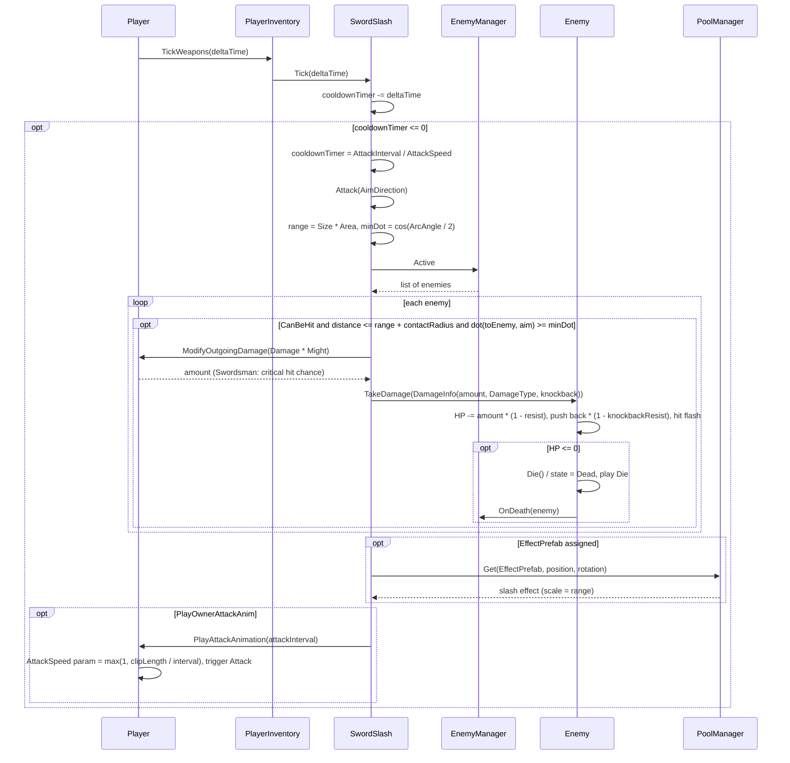
```mermaid
sequenceDiagram
    participant P as Player
    participant INV as PlayerInventory
    participant W as SwordSlash
    participant EM as EnemyManager
    participant E as Enemy
    participant PM as PoolManager

    P->>INV: TickWeapons(deltaTime)
    INV->>W: Tick(deltaTime)
    W->>W: cooldownTimer -= deltaTime
    opt cooldownTimer <= 0
        W->>W: cooldownTimer = AttackInterval / AttackSpeed
        W->>W: Attack(AimDirection)
        W->>W: range = Size * Area, minDot = cos(ArcAngle / 2)
        W->>EM: Active
        EM-->>W: list of enemies
        loop each enemy
            opt CanBeHit and distance <= range + contactRadius and dot(toEnemy, aim) >= minDot
                W->>P: ModifyOutgoingDamage(Damage * Might)
                P-->>W: amount (Swordsman: critical hit chance)
                W->>E: TakeDamage(DamageInfo(amount, DamageType, knockback))
                E->>E: HP -= amount * (1 - resist), push back * (1 - knockbackResist), hit flash
                opt HP <= 0
                    E->>E: Die() / state = Dead, play Die
                    E->>EM: OnDeath(enemy)
                end
            end
        end
        opt EffectPrefab assigned
            W->>PM: Get(EffectPrefab, position, rotation)
            PM-->>W: slash effect (scale = range)
        end
        opt PlayOwnerAttackAnim
            W->>P: PlayAttackAnimation(attackInterval)
            P->>P: AttackSpeed param = max(1, clipLength / interval), trigger Attack
        end
    end
```

---

## 3. Quái xuất hiện, truy đuổi và tấn công

### 3.1. Sơ đồ trạng thái: Enemy (gồm vòng đời trong pool)

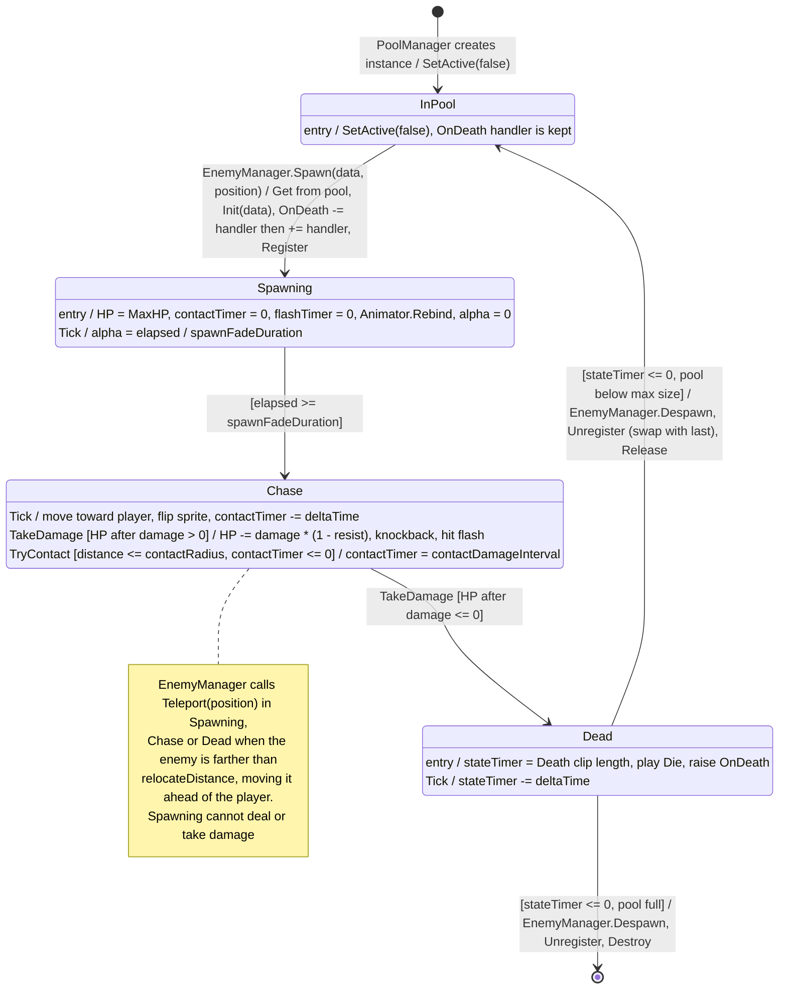
```mermaid
stateDiagram-v2
    state "InPool" as InPool
    state "Spawning" as Spawning
    state "Chase" as Chase
    state "Dead" as Dead

    [*] --> InPool : PoolManager creates instance / SetActive(false)

    InPool --> Spawning : EnemyManager.Spawn(data, position) / Get from pool, Init(data), OnDeath -= handler then += handler, Register
    Spawning --> Chase : [elapsed >= spawnFadeDuration]
    Chase --> Dead : TakeDamage [HP after damage <= 0]
    Dead --> InPool : [stateTimer <= 0, pool below max size] / EnemyManager.Despawn, Unregister (swap with last), Release
    Dead --> [*] : [stateTimer <= 0, pool full] / EnemyManager.Despawn, Unregister, Destroy

    InPool : entry / SetActive(false), OnDeath handler is kept
    Spawning : entry / HP = MaxHP, contactTimer = 0, flashTimer = 0, Animator.Rebind, alpha = 0
    Spawning : Tick / alpha = elapsed / spawnFadeDuration
    Chase : Tick / move toward player, flip sprite, contactTimer -= deltaTime
    Chase : TakeDamage [HP after damage > 0] / HP -= damage * (1 - resist), knockback, hit flash
    Chase : TryContact [distance <= contactRadius, contactTimer <= 0] / contactTimer = contactDamageInterval
    Dead : entry / stateTimer = Death clip length, play Die, raise OnDeath
    Dead : Tick / stateTimer -= deltaTime

    note right of Chase
        EnemyManager calls Teleport(position) in Spawning,
        Chase or Dead when the enemy is farther than
        relocateDistance, moving it ahead of the player.
        Spawning cannot deal or take damage
    end note
```

### 3.2. Sơ đồ tuần tự: spawn, cập nhật mỗi frame và thu hồi quái

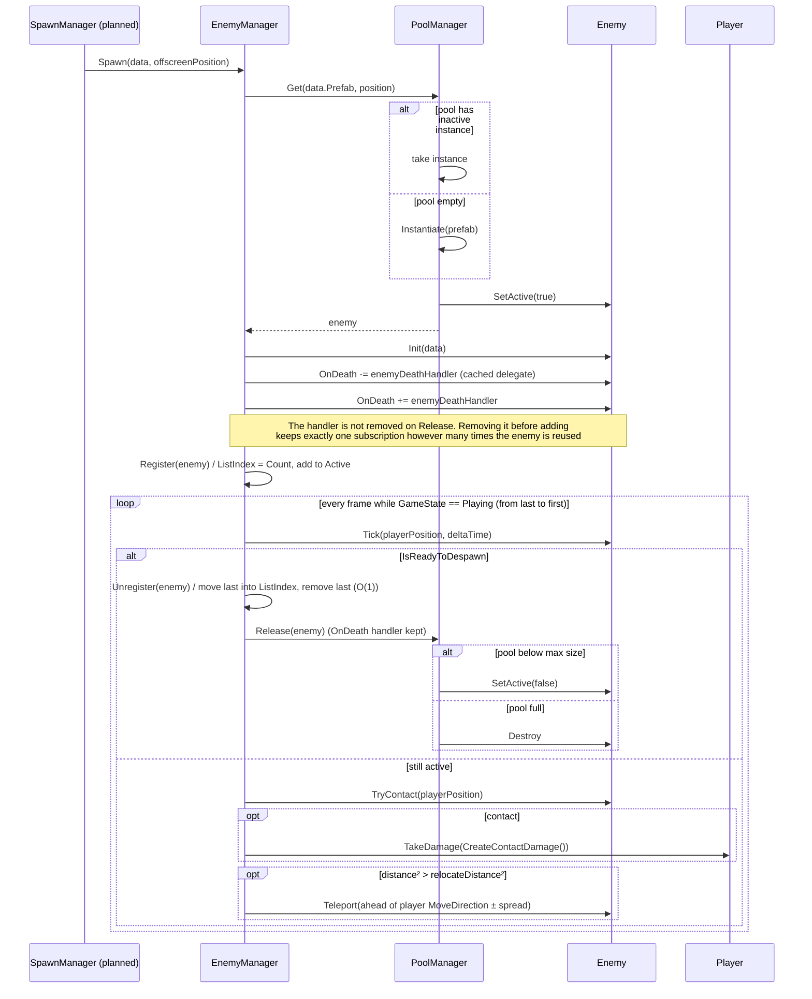
```mermaid
sequenceDiagram
    participant SRC as SpawnManager (planned)
    participant EM as EnemyManager
    participant PM as PoolManager
    participant E as Enemy
    participant P as Player

    SRC->>EM: Spawn(data, offscreenPosition)
    EM->>PM: Get(data.Prefab, position)
    alt pool has inactive instance
        PM->>PM: take instance
    else pool empty
        PM->>PM: Instantiate(prefab)
    end
    PM->>E: SetActive(true)
    PM-->>EM: enemy
    EM->>E: Init(data)
    EM->>E: OnDeath -= enemyDeathHandler (cached delegate)
    EM->>E: OnDeath += enemyDeathHandler
    Note over EM,E: The handler is not removed on Release. Removing it before adding<br/>keeps exactly one subscription however many times the enemy is reused
    EM->>EM: Register(enemy) / ListIndex = Count, add to Active

    loop every frame while GameState == Playing (from last to first)
        EM->>E: Tick(playerPosition, deltaTime)
        alt IsReadyToDespawn
            EM->>EM: Unregister(enemy) / move last into ListIndex, remove last (O(1))
            EM->>PM: Release(enemy) (OnDeath handler kept)
            alt pool below max size
                PM->>E: SetActive(false)
            else pool full
                PM->>E: Destroy
            end
        else still active
            EM->>E: TryContact(playerPosition)
            opt contact
                EM->>P: TakeDamage(CreateContactDamage())
            end
            opt distance² > relocateDistance²
                EM->>E: Teleport(ahead of player MoveDirection ± spread)
            end
        end
    end
```

---

## 4. Thu thập kinh nghiệm và vàng

### 4.1. Sơ đồ trạng thái: Pickup (gem / coin)

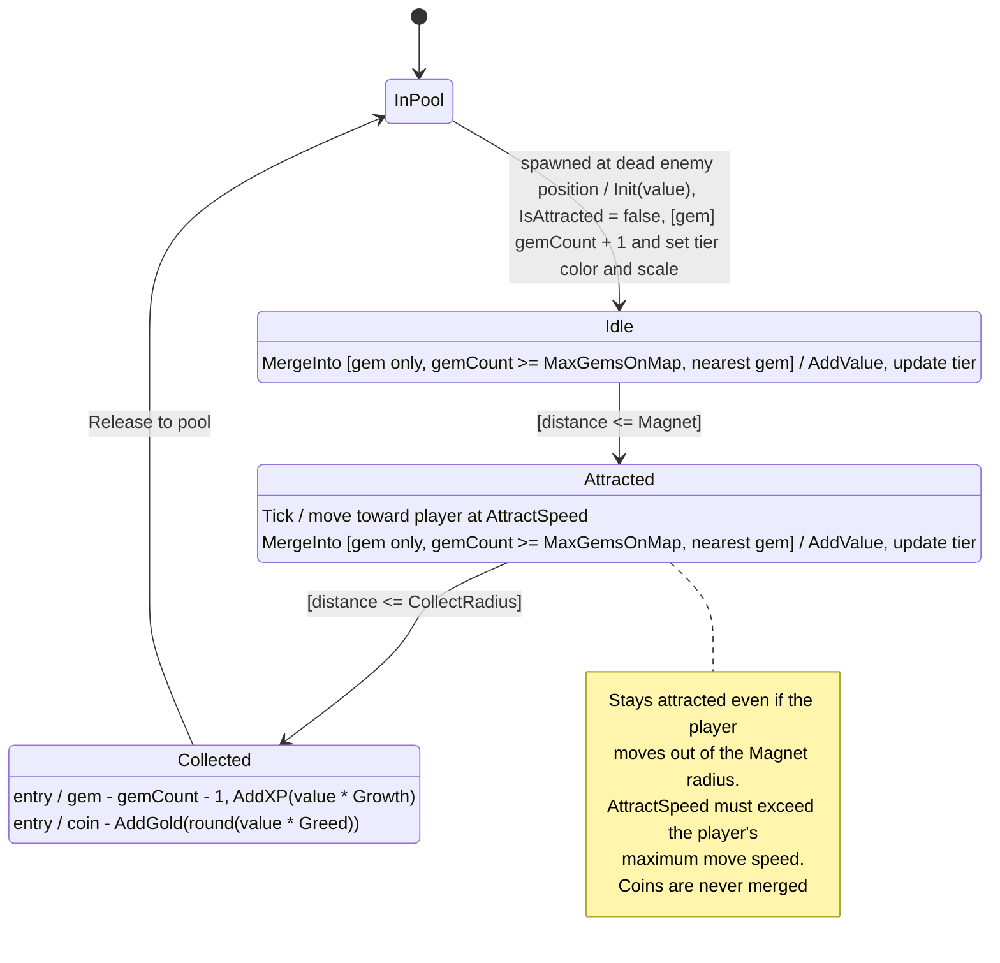
```mermaid
stateDiagram-v2
    state "InPool" as InPool
    state "Idle" as Idle
    state "Attracted" as Attracted
    state "Collected" as Collected

    [*] --> InPool

    InPool --> Idle : spawned at dead enemy position / Init(value), IsAttracted = false, [gem] gemCount + 1 and set tier color and scale
    Idle --> Attracted : [distance <= Magnet]
    Attracted --> Collected : [distance <= CollectRadius]
    Collected --> InPool : Release to pool

    Idle : MergeInto [gem only, gemCount >= MaxGemsOnMap, nearest gem] / AddValue, update tier
    Attracted : Tick / move toward player at AttractSpeed
    Attracted : MergeInto [gem only, gemCount >= MaxGemsOnMap, nearest gem] / AddValue, update tier
    Collected : entry / gem - gemCount - 1, AddXP(value * Growth)
    Collected : entry / coin - AddGold(round(value * Greed))

    note right of Attracted
        Stays attracted even if the player
        moves out of the Magnet radius.
        AttractSpeed must exceed the player's
        maximum move speed.
        Coins are never merged
    end note
```

### 4.2. Sơ đồ tuần tự: quái chết rơi đồ và người chơi nhặt

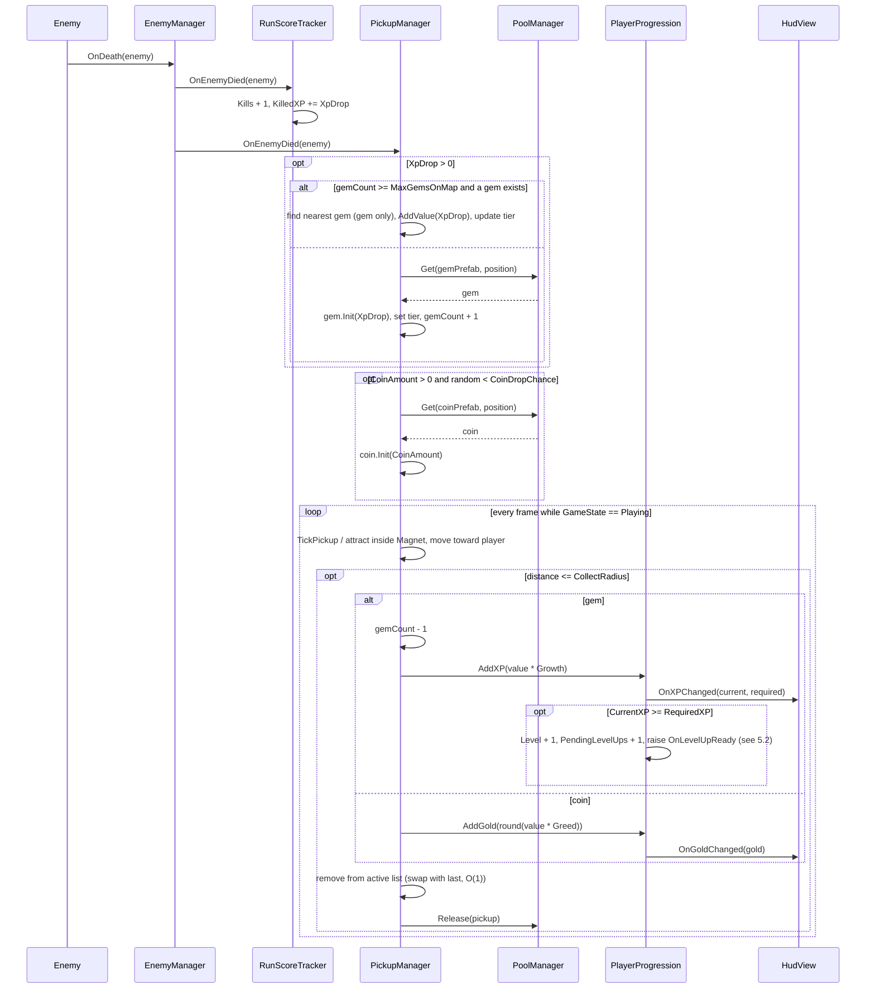
```mermaid
sequenceDiagram
    participant E as Enemy
    participant EM as EnemyManager
    participant ST as RunScoreTracker
    participant PU as PickupManager
    participant PM as PoolManager
    participant PP as PlayerProgression
    participant HUD as HudView

    E->>EM: OnDeath(enemy)
    EM->>ST: OnEnemyDied(enemy)
    ST->>ST: Kills + 1, KilledXP += XpDrop
    EM->>PU: OnEnemyDied(enemy)

    opt XpDrop > 0
        alt gemCount >= MaxGemsOnMap and a gem exists
            PU->>PU: find nearest gem (gem only), AddValue(XpDrop), update tier
        else
            PU->>PM: Get(gemPrefab, position)
            PM-->>PU: gem
            PU->>PU: gem.Init(XpDrop), set tier, gemCount + 1
        end
    end
    opt CoinAmount > 0 and random < CoinDropChance
        PU->>PM: Get(coinPrefab, position)
        PM-->>PU: coin
        PU->>PU: coin.Init(CoinAmount)
    end

    loop every frame while GameState == Playing
        PU->>PU: TickPickup / attract inside Magnet, move toward player
        opt distance <= CollectRadius
            alt gem
                PU->>PU: gemCount - 1
                PU->>PP: AddXP(value * Growth)
                PP->>HUD: OnXPChanged(current, required)
                opt CurrentXP >= RequiredXP
                    PP->>PP: Level + 1, PendingLevelUps + 1, raise OnLevelUpReady (see 5.2)
                end
            else coin
                PU->>PP: AddGold(round(value * Greed))
                PP->>HUD: OnGoldChanged(gold)
            end
            PU->>PU: remove from active list (swap with last, O(1))
            PU->>PM: Release(pickup)
        end
    end
```

---

## 5. Lên cấp và chọn nâng cấp

### 5.1. Sơ đồ trạng thái: GameManager

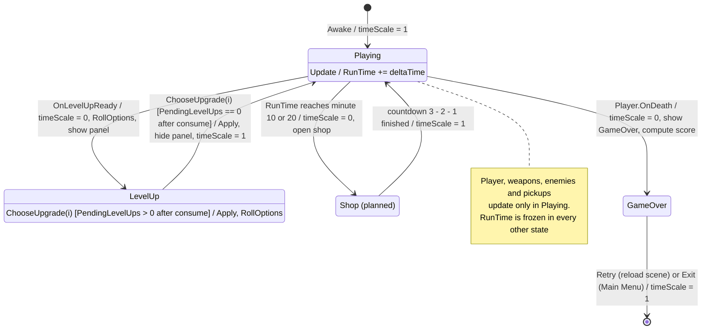
```mermaid
stateDiagram-v2
    state "Playing" as Playing
    state "LevelUp" as LevelUp
    state "Shop (planned)" as Shop
    state "GameOver" as GameOver

    [*] --> Playing : Awake / timeScale = 1

    Playing --> LevelUp : OnLevelUpReady / timeScale = 0, RollOptions, show panel
    LevelUp --> Playing : ChooseUpgrade(i) [PendingLevelUps == 0 after consume] / Apply, hide panel, timeScale = 1

    Playing --> Shop : RunTime reaches minute 10 or 20 / timeScale = 0, open shop
    Shop --> Playing : countdown 3 - 2 - 1 finished / timeScale = 1

    Playing --> GameOver : Player.OnDeath / timeScale = 0, show GameOver, compute score
    GameOver --> [*] : Retry (reload scene) or Exit (Main Menu) / timeScale = 1

    Playing : Update / RunTime += deltaTime
    LevelUp : ChooseUpgrade(i) [PendingLevelUps > 0 after consume] / Apply, RollOptions

    note right of Playing
        Player, weapons, enemies and pickups
        update only in Playing.
        RunTime is frozen in every other state
    end note
```

### 5.2. Sơ đồ tuần tự: lên cấp và chọn thẻ

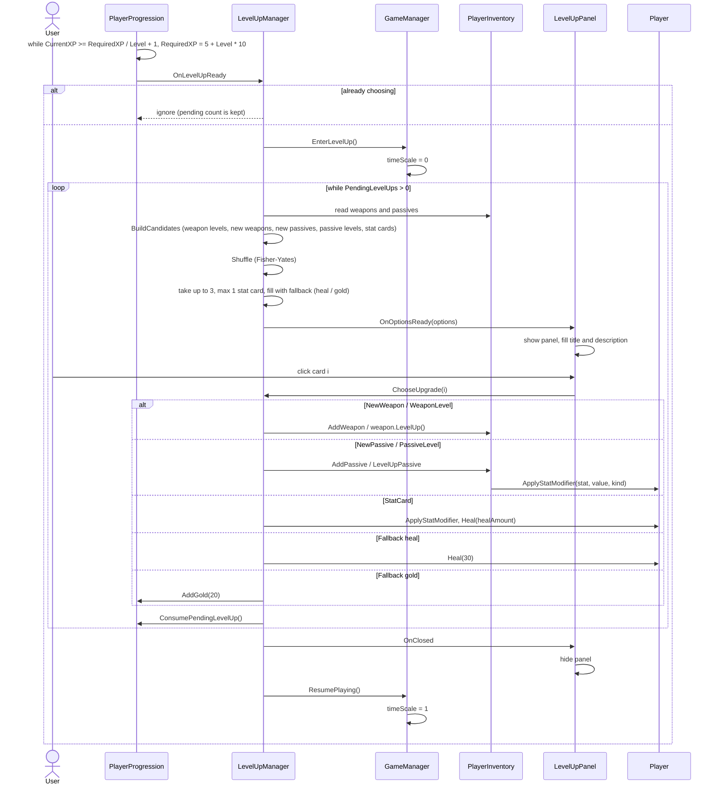
```mermaid
sequenceDiagram
    actor U as User
    participant PP as PlayerProgression
    participant LM as LevelUpManager
    participant GM as GameManager
    participant INV as PlayerInventory
    participant UI as LevelUpPanel
    participant P as Player

    PP->>PP: while CurrentXP >= RequiredXP / Level + 1, RequiredXP = 5 + Level * 10
    PP->>LM: OnLevelUpReady
    alt already choosing
        LM-->>PP: ignore (pending count is kept)
    else
        LM->>GM: EnterLevelUp()
        GM->>GM: timeScale = 0
        loop while PendingLevelUps > 0
            LM->>INV: read weapons and passives
            LM->>LM: BuildCandidates (weapon levels, new weapons, new passives, passive levels, stat cards)
            LM->>LM: Shuffle (Fisher-Yates)
            LM->>LM: take up to 3, max 1 stat card, fill with fallback (heal / gold)
            LM->>UI: OnOptionsReady(options)
            UI->>UI: show panel, fill title and description
            U->>UI: click card i
            UI->>LM: ChooseUpgrade(i)
            alt NewWeapon / WeaponLevel
                LM->>INV: AddWeapon / weapon.LevelUp()
            else NewPassive / PassiveLevel
                LM->>INV: AddPassive / LevelUpPassive
                INV->>P: ApplyStatModifier(stat, value, kind)
            else StatCard
                LM->>P: ApplyStatModifier, Heal(healAmount)
            else Fallback heal
                LM->>P: Heal(30)
            else Fallback gold
                LM->>PP: AddGold(20)
            end
            LM->>PP: ConsumePendingLevelUp()
        end
        LM->>UI: OnClosed
        UI->>UI: hide panel
        LM->>GM: ResumePlaying()
        GM->>GM: timeScale = 1
    end
```

---

## 6. Shop trong ván *(planned)*

### 6.1. Sơ đồ trạng thái: Shop

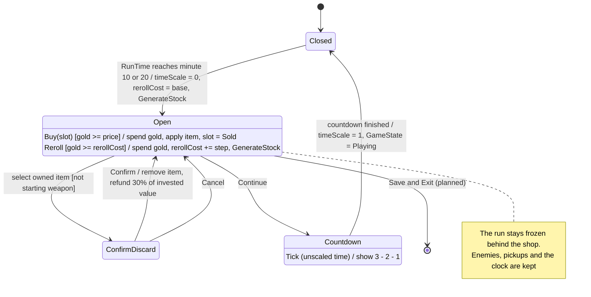
```mermaid
stateDiagram-v2
    state "Closed" as Closed
    state "Open" as Open
    state "ConfirmDiscard" as ConfirmDiscard
    state "Countdown" as Countdown

    [*] --> Closed

    Closed --> Open : RunTime reaches minute 10 or 20 / timeScale = 0, rerollCost = base, GenerateStock
    Open --> ConfirmDiscard : select owned item [not starting weapon]
    ConfirmDiscard --> Open : Confirm / remove item, refund 30% of invested value
    ConfirmDiscard --> Open : Cancel
    Open --> Countdown : Continue
    Countdown --> Closed : countdown finished / timeScale = 1, GameState = Playing
    Open --> [*] : Save and Exit (planned)

    Open : Buy(slot) [gold >= price] / spend gold, apply item, slot = Sold
    Open : Reroll [gold >= rerollCost] / spend gold, rerollCost += step, GenerateStock
    Countdown : Tick (unscaled time) / show 3 - 2 - 1

    note right of Open
        The run stays frozen behind the shop.
        Enemies, pickups and the clock are kept
    end note
```

### 6.2. Sơ đồ tuần tự: mở Shop, bày hàng và mua một món

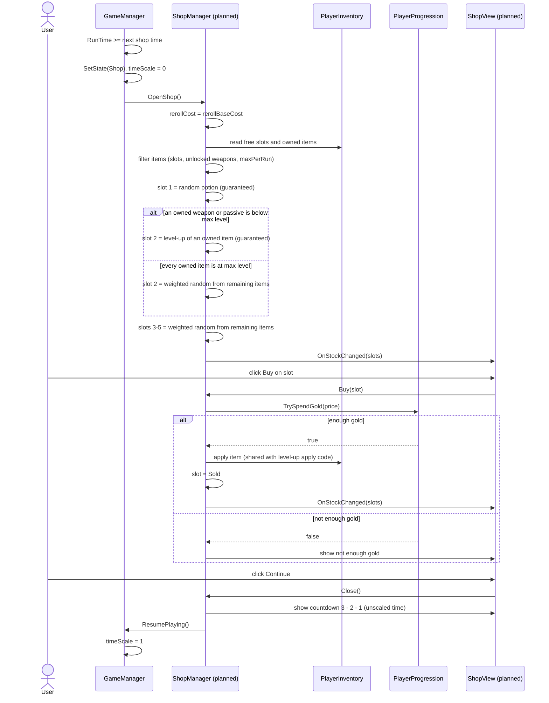
```mermaid
sequenceDiagram
    actor U as User
    participant GM as GameManager
    participant SM as ShopManager (planned)
    participant INV as PlayerInventory
    participant PP as PlayerProgression
    participant UI as ShopView (planned)

    GM->>GM: RunTime >= next shop time
    GM->>GM: SetState(Shop), timeScale = 0
    GM->>SM: OpenShop()
    SM->>SM: rerollCost = rerollBaseCost
    SM->>INV: read free slots and owned items
    SM->>SM: filter items (slots, unlocked weapons, maxPerRun)
    SM->>SM: slot 1 = random potion (guaranteed)
    alt an owned weapon or passive is below max level
        SM->>SM: slot 2 = level-up of an owned item (guaranteed)
    else every owned item is at max level
        SM->>SM: slot 2 = weighted random from remaining items
    end
    SM->>SM: slots 3-5 = weighted random from remaining items
    SM->>UI: OnStockChanged(slots)

    U->>UI: click Buy on slot
    UI->>SM: Buy(slot)
    SM->>PP: TrySpendGold(price)
    alt enough gold
        PP-->>SM: true
        SM->>INV: apply item (shared with level-up apply code)
        SM->>SM: slot = Sold
        SM->>UI: OnStockChanged(slots)
    else not enough gold
        PP-->>SM: false
        SM->>UI: show not enough gold
    end

    U->>UI: click Continue
    UI->>SM: Close()
    SM->>UI: show countdown 3 - 2 - 1 (unscaled time)
    SM->>GM: ResumePlaying()
    GM->>GM: timeScale = 1
```

---

## 7. Sơ đồ tuần tự bổ sung theo use case

### 7.1. UC1: Chọn nhân vật và độ khó, vào ván

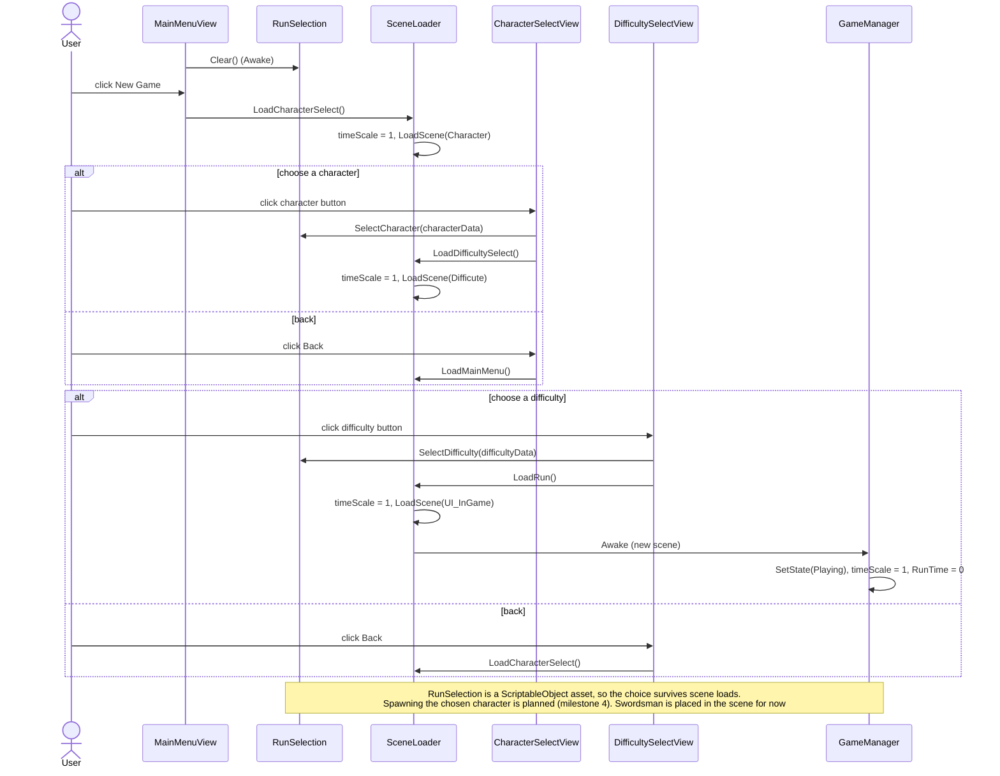
```mermaid
sequenceDiagram
    actor U as User
    participant MM as MainMenuView
    participant RS as RunSelection
    participant SL as SceneLoader
    participant CS as CharacterSelectView
    participant DS as DifficultySelectView
    participant GM as GameManager

    MM->>RS: Clear() (Awake)
    U->>MM: click New Game
    MM->>SL: LoadCharacterSelect()
    SL->>SL: timeScale = 1, LoadScene(Character)

    alt choose a character
        U->>CS: click character button
        CS->>RS: SelectCharacter(characterData)
        CS->>SL: LoadDifficultySelect()
        SL->>SL: timeScale = 1, LoadScene(Difficute)
    else back
        U->>CS: click Back
        CS->>SL: LoadMainMenu()
    end

    alt choose a difficulty
        U->>DS: click difficulty button
        DS->>RS: SelectDifficulty(difficultyData)
        DS->>SL: LoadRun()
        SL->>SL: timeScale = 1, LoadScene(UI_InGame)
        SL->>GM: Awake (new scene)
        GM->>GM: SetState(Playing), timeScale = 1, RunTime = 0
    else back
        U->>DS: click Back
        DS->>SL: LoadCharacterSelect()
    end

    Note over RS,GM: RunSelection is a ScriptableObject asset, so the choice survives scene loads.<br/>Spawning the chosen character is planned (milestone 4). Swordsman is placed in the scene for now
```

### 7.2. UC2: Di chuyển và ngắm (một frame của Player)

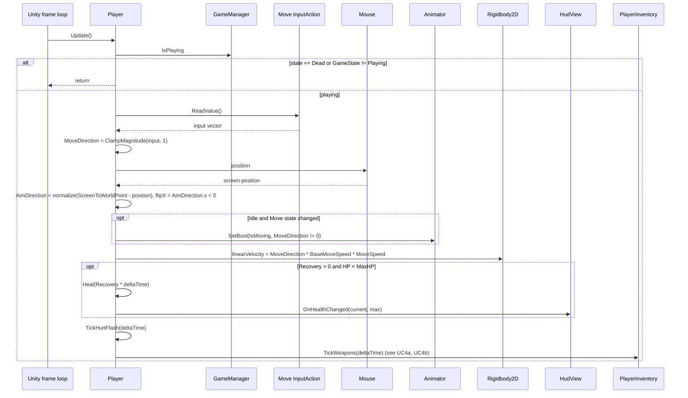
```mermaid
sequenceDiagram
    participant UN as Unity frame loop
    participant P as Player
    participant GM as GameManager
    participant IA as Move InputAction
    participant MS as Mouse
    participant AN as Animator
    participant RB as Rigidbody2D
    participant HUD as HudView
    participant INV as PlayerInventory

    UN->>P: Update()
    P->>GM: IsPlaying
    alt state == Dead or GameState != Playing
        P-->>UN: return
    else playing
        P->>IA: ReadValue()
        IA-->>P: input vector
        P->>P: MoveDirection = ClampMagnitude(input, 1)
        P->>MS: position
        MS-->>P: screen position
        P->>P: AimDirection = normalize(ScreenToWorldPoint - position), flipX = AimDirection.x < 0
        opt Idle and Move state changed
            P->>AN: SetBool(IsMoving, MoveDirection != 0)
        end
        P->>RB: linearVelocity = MoveDirection * BaseMoveSpeed * MoveSpeed
        opt Recovery > 0 and HP < MaxHP
            P->>P: Heal(Recovery * deltaTime)
            P->>HUD: OnHealthChanged(current, max)
        end
        P->>P: TickHurtFlash(deltaTime)
        P->>INV: TickWeapons(deltaTime) (see UC4a, UC4b)
    end
```

### 7.3. UC3: Xem bảng chỉ số (giữ Tab)

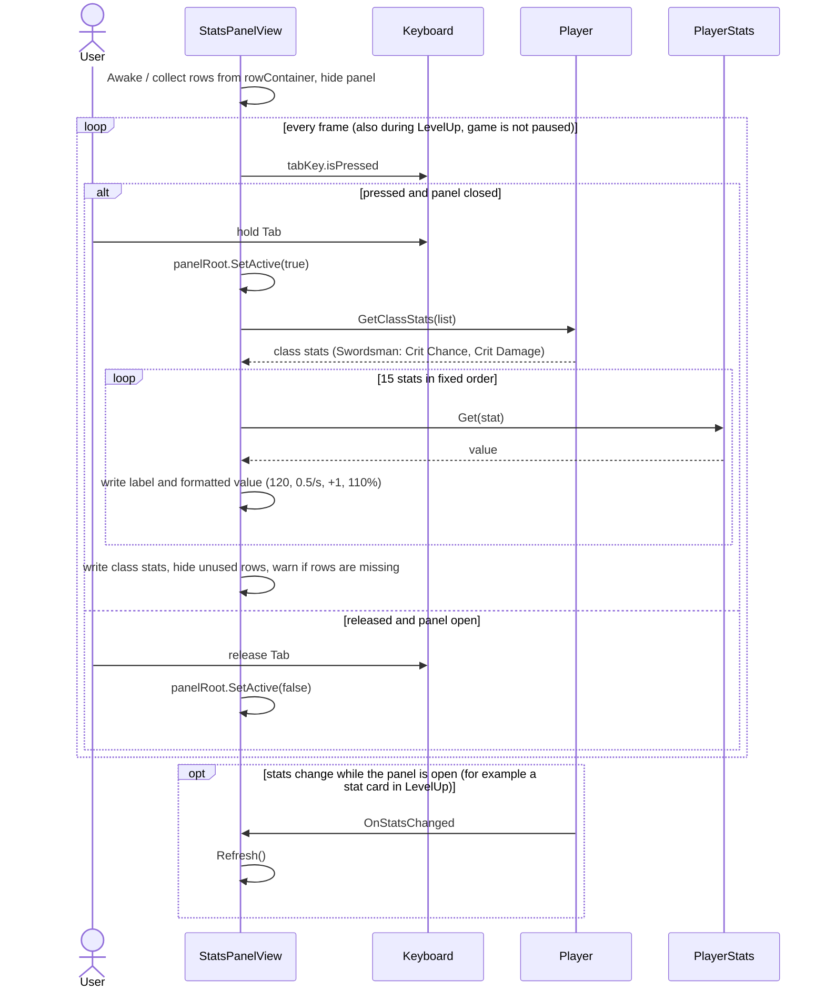
```mermaid
sequenceDiagram
    actor U as User
    participant SP as StatsPanelView
    participant KB as Keyboard
    participant P as Player
    participant PS as PlayerStats

    SP->>SP: Awake / collect rows from rowContainer, hide panel

    loop every frame (also during LevelUp, game is not paused)
        SP->>KB: tabKey.isPressed
        alt pressed and panel closed
            U->>KB: hold Tab
            SP->>SP: panelRoot.SetActive(true)
            SP->>P: GetClassStats(list)
            P-->>SP: class stats (Swordsman: Crit Chance, Crit Damage)
            loop 15 stats in fixed order
                SP->>PS: Get(stat)
                PS-->>SP: value
                SP->>SP: write label and formatted value (120, 0.5/s, +1, 110%)
            end
            SP->>SP: write class stats, hide unused rows, warn if rows are missing
        else released and panel open
            U->>KB: release Tab
            SP->>SP: panelRoot.SetActive(false)
        end
    end

    opt stats change while the panel is open (for example a stat card in LevelUp)
        P->>SP: OnStatsChanged
        SP->>SP: Refresh()
    end
```

### 7.4. UC4b: Tấn công tầm xa *(planned)*

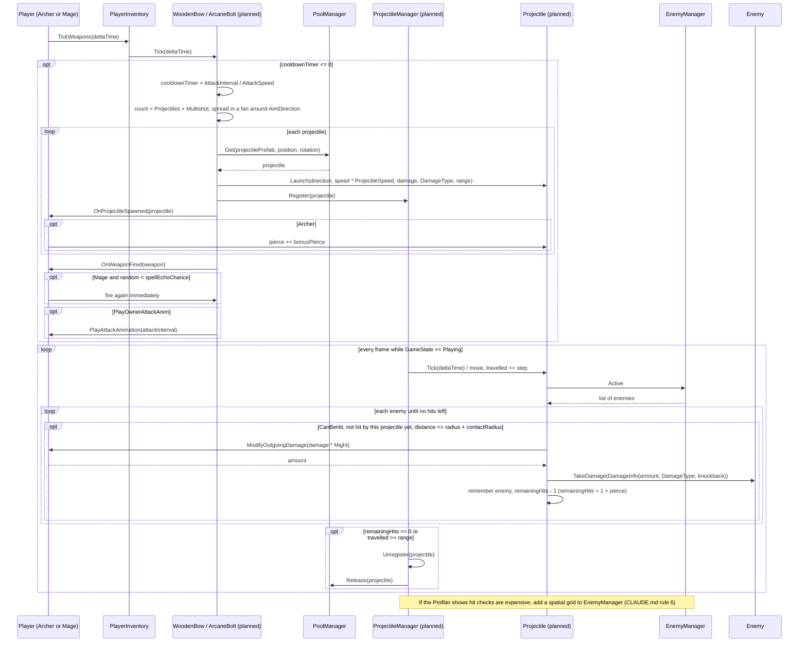
```mermaid
sequenceDiagram
    participant P as Player (Archer or Mage)
    participant INV as PlayerInventory
    participant W as WoodenBow / ArcaneBolt (planned)
    participant PM as PoolManager
    participant PJM as ProjectileManager (planned)
    participant PR as Projectile (planned)
    participant EM as EnemyManager
    participant E as Enemy

    P->>INV: TickWeapons(deltaTime)
    INV->>W: Tick(deltaTime)
    opt cooldownTimer <= 0
        W->>W: cooldownTimer = AttackInterval / AttackSpeed
        W->>W: count = Projectiles + Multishot, spread in a fan around AimDirection
        loop each projectile
            W->>PM: Get(projectilePrefab, position, rotation)
            PM-->>W: projectile
            W->>PR: Launch(direction, speed * ProjectileSpeed, damage, DamageType, range)
            W->>PJM: Register(projectile)
            W->>P: OnProjectileSpawned(projectile)
            opt Archer
                P->>PR: pierce += bonusPierce
            end
        end
        W->>P: OnWeaponFired(weapon)
        opt Mage and random < spellEchoChance
            P->>W: fire again immediately
        end
        opt PlayOwnerAttackAnim
            W->>P: PlayAttackAnimation(attackInterval)
        end
    end

    loop every frame while GameState == Playing
        PJM->>PR: Tick(deltaTime) / move, travelled += step
        PR->>EM: Active
        EM-->>PR: list of enemies
        loop each enemy until no hits left
            opt CanBeHit, not hit by this projectile yet, distance <= radius + contactRadius
                PR->>P: ModifyOutgoingDamage(damage * Might)
                P-->>PR: amount
                PR->>E: TakeDamage(DamageInfo(amount, DamageType, knockback))
                PR->>PR: remember enemy, remainingHits - 1 (remainingHits = 1 + pierce)
            end
        end
        opt remainingHits == 0 or travelled >= range
            PJM->>PJM: Unregister(projectile)
            PJM->>PM: Release(projectile)
        end
    end

    Note over PJM,EM: If the Profiler shows hit checks are expensive, add a spatial grid to EnemyManager (CLAUDE.md rule 6)
```

### 7.5. UC7: Quái chết và thu hồi

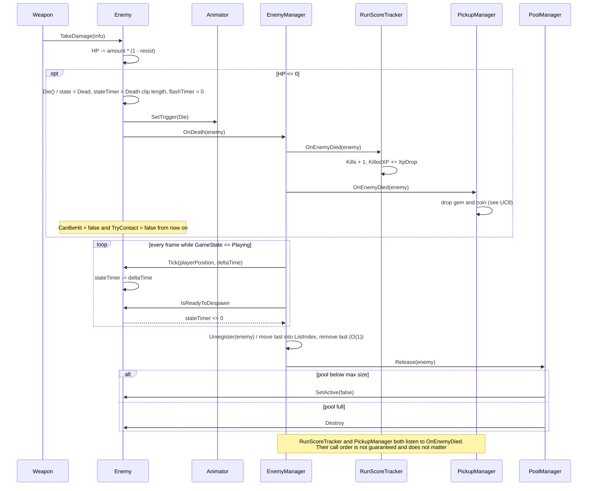
```mermaid
sequenceDiagram
    participant W as Weapon
    participant E as Enemy
    participant AN as Animator
    participant EM as EnemyManager
    participant ST as RunScoreTracker
    participant PU as PickupManager
    participant PM as PoolManager

    W->>E: TakeDamage(info)
    E->>E: HP -= amount * (1 - resist)
    opt HP <= 0
        E->>E: Die() / state = Dead, stateTimer = Death clip length, flashTimer = 0
        E->>AN: SetTrigger(Die)
        E->>EM: OnDeath(enemy)
        EM->>ST: OnEnemyDied(enemy)
        ST->>ST: Kills + 1, KilledXP += XpDrop
        EM->>PU: OnEnemyDied(enemy)
        PU->>PU: drop gem and coin (see UC8)
        Note over E: CanBeHit = false and TryContact = false from now on
    end

    loop every frame while GameState == Playing
        EM->>E: Tick(playerPosition, deltaTime)
        E->>E: stateTimer -= deltaTime
        EM->>E: IsReadyToDespawn
        E-->>EM: stateTimer <= 0
    end

    EM->>EM: Unregister(enemy) / move last into ListIndex, remove last (O(1))
    EM->>PM: Release(enemy)
    alt pool below max size
        PM->>E: SetActive(false)
    else pool full
        PM->>E: Destroy
    end

    Note over EM,PU: RunScoreTracker and PickupManager both listen to OnEnemyDied.<br/>Their call order is not guaranteed and does not matter
```

### 7.6. UC11: Làm mới hàng và bỏ đồ *(planned)*

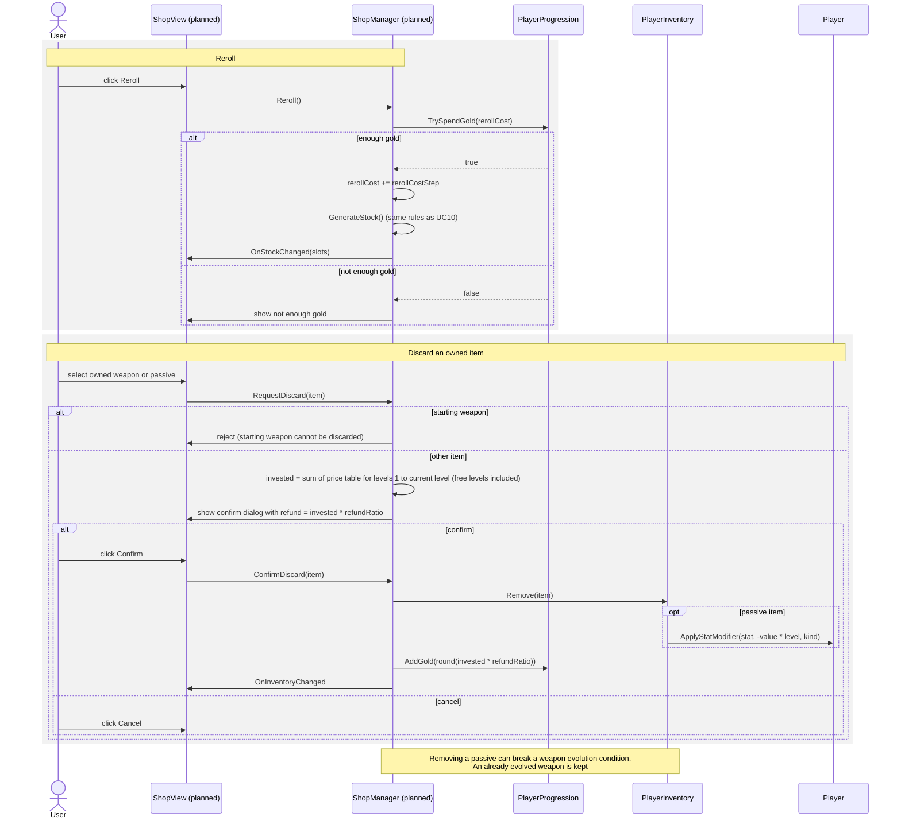
```mermaid
sequenceDiagram
    actor U as User
    participant UI as ShopView (planned)
    participant SM as ShopManager (planned)
    participant PP as PlayerProgression
    participant INV as PlayerInventory
    participant P as Player

    rect rgba(128, 128, 128, 0.1)
        Note over U,SM: Reroll
        U->>UI: click Reroll
        UI->>SM: Reroll()
        SM->>PP: TrySpendGold(rerollCost)
        alt enough gold
            PP-->>SM: true
            SM->>SM: rerollCost += rerollCostStep
            SM->>SM: GenerateStock() (same rules as UC10)
            SM->>UI: OnStockChanged(slots)
        else not enough gold
            PP-->>SM: false
            SM->>UI: show not enough gold
        end
    end

    rect rgba(128, 128, 128, 0.1)
        Note over U,P: Discard an owned item
        U->>UI: select owned weapon or passive
        UI->>SM: RequestDiscard(item)
        alt starting weapon
            SM->>UI: reject (starting weapon cannot be discarded)
        else other item
            SM->>SM: invested = sum of price table for levels 1 to current level (free levels included)
            SM->>UI: show confirm dialog with refund = invested * refundRatio
            alt confirm
                U->>UI: click Confirm
                UI->>SM: ConfirmDiscard(item)
                SM->>INV: Remove(item)
                opt passive item
                    INV->>P: ApplyStatModifier(stat, -value * level, kind)
                end
                SM->>PP: AddGold(round(invested * refundRatio))
                SM->>UI: OnInventoryChanged
            else cancel
                U->>UI: click Cancel
            end
        end
    end

    Note over SM,INV: Removing a passive can break a weapon evolution condition.<br/>An already evolved weapon is kept
```

### 7.7. UC12: Thua, tính điểm, chơi lại hoặc về menu

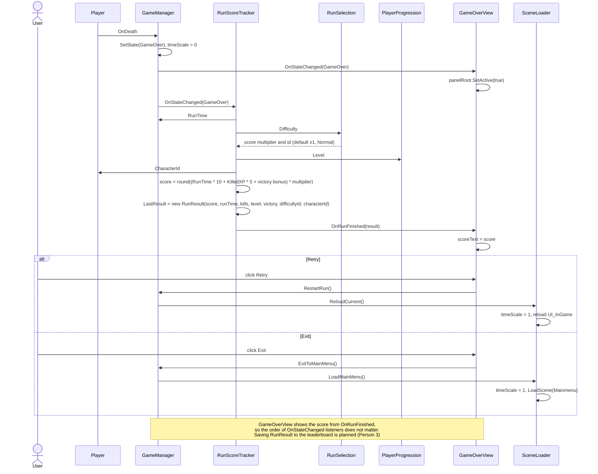
```mermaid
sequenceDiagram
    actor U as User
    participant P as Player
    participant GM as GameManager
    participant ST as RunScoreTracker
    participant RS as RunSelection
    participant PP as PlayerProgression
    participant GO as GameOverView
    participant SL as SceneLoader

    P->>GM: OnDeath
    GM->>GM: SetState(GameOver), timeScale = 0
    GM->>GO: OnStateChanged(GameOver)
    GO->>GO: panelRoot.SetActive(true)
    GM->>ST: OnStateChanged(GameOver)
    ST->>GM: RunTime
    ST->>RS: Difficulty
    RS-->>ST: score multiplier and id (default x1, Normal)
    ST->>PP: Level
    ST->>P: CharacterId
    ST->>ST: score = round((RunTime * 10 + KilledXP * 5 + victory bonus) * multiplier)
    ST->>ST: LastResult = new RunResult(score, runTime, kills, level, victory, difficultyId, characterId)
    ST->>GO: OnRunFinished(result)
    GO->>GO: scoreText = score

    alt Retry
        U->>GO: click Retry
        GO->>GM: RestartRun()
        GM->>SL: ReloadCurrent()
        SL->>SL: timeScale = 1, reload UI_InGame
    else Exit
        U->>GO: click Exit
        GO->>GM: ExitToMainMenu()
        GM->>SL: LoadMainMenu()
        SL->>SL: timeScale = 1, LoadScene(Mainmenu)
    end

    Note over GM,GO: GameOverView shows the score from OnRunFinished,<br/>so the order of OnStateChanged listeners does not matter.<br/>Saving RunResult to the leaderboard is planned (Person 3)
```
